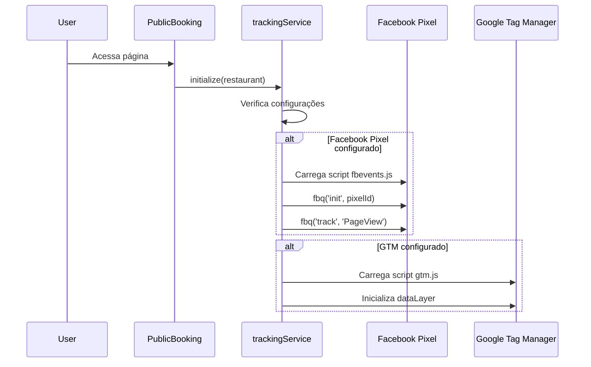
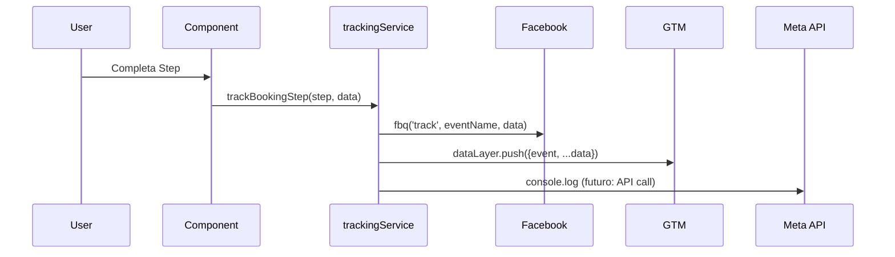

# Implementação Técnica - Sistema de Tracking

## 📐 Arquitetura

### Camadas da Aplicação

```
┌─────────────────────────────────────────────────────────┐
│                    Frontend (React)                      │
├─────────────────────────────────────────────────────────┤
│  PublicBooking.jsx / BookingPublic.jsx                  │
│  ├─ useEffect: Initialize tracking                      │
│  ├─ handleStep1Complete: Track ViewContent             │
│  ├─ handleStep2Complete: Track AddToCart               │
│  ├─ handleStep3Complete: Track InitiateCheckout        │
│  └─ Reservation Success: Track Purchase/Lead           │
├─────────────────────────────────────────────────────────┤
│  trackingService.js (Singleton)                         │
│  ├─ initialize(restaurant)                              │
│  ├─ initializeFacebookPixel()                           │
│  ├─ initializeGTM()                                     │
│  ├─ trackEvent(name, data)                              │
│  ├─ trackBookingStep(step, data)                        │
│  ├─ trackReservationComplete(data)                      │
│  └─ setUserData(userData)                               │
├─────────────────────────────────────────────────────────┤
│  TrackingSettings.jsx                                   │
│  └─ UI para configurar Pixel ID, API Token, GTM ID     │
└─────────────────────────────────────────────────────────┘
                           ↓
┌─────────────────────────────────────────────────────────┐
│                   Backend (Node.js)                      │
├─────────────────────────────────────────────────────────┤
│  Restaurant Model (Prisma)                              │
│  ├─ facebook_pixel_id: String?                          │
│  ├─ meta_conversion_api_token: String?                  │
│  └─ gtm_container_id: String?                           │
└─────────────────────────────────────────────────────────┘
                           ↓
┌─────────────────────────────────────────────────────────┐
│              Plataformas de Tracking                     │
├─────────────────────────────────────────────────────────┤
│  Facebook Pixel (Client-side)                           │
│  Meta Conversions API (Server-side - futuro)            │
│  Google Tag Manager (Client-side)                       │
└─────────────────────────────────────────────────────────┘
```

## 🔧 Componentes Principais

### 1. trackingService.js

Serviço singleton que gerencia todas as integrações de tracking.

**Métodos Principais:**

```javascript
// Inicializar tracking com configurações do restaurante
initialize(restaurant)

// Rastrear evento genérico
trackEvent(eventName, eventData)

// Rastrear progressão nos steps de reserva
trackBookingStep(step, data)

// Rastrear conclusão de reserva
trackReservationComplete(reservationData)

// Definir dados do usuário para enhanced matching
setUserData(userData)
```

**Mapeamento de Eventos:**

| Step | Evento Facebook | Evento GTM | Descrição |
|------|----------------|------------|-----------|
| 1 | ViewContent | ViewContent | Visualizou formulário |
| 2 | AddToCart | AddToCart | Selecionou horário |
| 3 | InitiateCheckout | InitiateCheckout | Preencheu dados |
| Conclusão | Purchase + Lead | Purchase | Reserva concluída |

### 2. TrackingSettings.jsx

Interface de configuração para donos de restaurantes.

**Features:**
- Campos para Pixel ID, API Token, GTM Container ID
- Validação de formato
- Toggle de visibilidade para tokens sensíveis
- Links para documentação oficial
- Card de instruções de teste

### 3. Integração nas Páginas de Reserva

**PublicBooking.jsx e BookingPublic.jsx:**

```javascript
// 1. Inicialização
useEffect(() => {
  if (restaurant) {
    trackingService.initialize(restaurant);
  }
}, [restaurant]);

// 2. Tracking em cada step
handleStep1Complete(data) {
  trackingService.trackBookingStep(1, data);
  // ... resto da lógica
}

// 3. Tracking de conversão
// Após criar reserva com sucesso
trackingService.trackReservationComplete({
  reservation_code: code,
  party_size: finalData.party_size,
  date: finalData.date,
  slot_time: finalData.slot_time,
});
```

## 🗄️ Schema do Banco de Dados

### Tabela: restaurants

```sql
ALTER TABLE restaurants 
ADD COLUMN facebook_pixel_id VARCHAR(255) DEFAULT NULL,
ADD COLUMN meta_conversion_api_token VARCHAR(500) DEFAULT NULL,
ADD COLUMN gtm_container_id VARCHAR(255) DEFAULT NULL;
```

**Índices:**
- `idx_restaurants_facebook_pixel` em `facebook_pixel_id`
- `idx_restaurants_gtm_container` em `gtm_container_id`

## 📊 Fluxo de Dados Detalhado

### Inicialização



### Tracking de Evento



## 🔐 Segurança e Privacidade

### Dados Sensíveis

1. **Meta Conversion API Token:**
   - Armazenado no banco de dados
   - Nunca exposto no frontend em produção
   - Usado apenas em chamadas server-side (futuro)

2. **Dados do Usuário:**
   - Email e telefone hasheados antes do envio (Advanced Matching)
   - Conformidade com GDPR/LGPD
   - Usuário pode optar por não fornecer dados opcionais

### Best Practices

```javascript
// ✅ BOM: Hash de dados sensíveis
window.fbq('init', pixelId, {
  em: hashEmail(userData.email),
  ph: hashPhone(userData.phone)
});

// ❌ RUIM: Enviar dados em texto plano
window.fbq('init', pixelId, {
  em: userData.email,
  ph: userData.phone
});
```

## 🧪 Testes

### Testes Manuais

1. **Facebook Pixel:**
   ```bash
   # Instalar extensão Facebook Pixel Helper
   # Acessar página de reserva
   # Verificar eventos no console da extensão
   ```

2. **Google Tag Manager:**
   ```bash
   # Ativar Preview Mode no GTM
   # Acessar página de reserva
   # Verificar eventos no Tag Assistant
   ```

3. **Meta Conversions API:**
   ```bash
   # Acessar Facebook Events Manager
   # Ir em Test Events
   # Verificar eventos recebidos
   ```

### Testes Automatizados (Futuro)

```javascript
describe('trackingService', () => {
  it('should initialize Facebook Pixel when configured', () => {
    const restaurant = {
      facebook_pixel_id: '123456789'
    };
    trackingService.initialize(restaurant);
    expect(window.fbq).toBeDefined();
  });

  it('should track booking step events', () => {
    const spy = jest.spyOn(window, 'fbq');
    trackingService.trackBookingStep(1, { date: '2024-01-01' });
    expect(spy).toHaveBeenCalledWith('track', 'ViewContent', expect.any(Object));
  });
});
```

## 🚀 Melhorias Futuras

### 1. Meta Conversions API Server-Side

Criar endpoint backend para enviar eventos:

```typescript
// backend/src/routes/tracking.routes.ts
router.post('/track-event', async (req, res) => {
  const { eventName, eventData, restaurantId } = req.body;
  
  const restaurant = await getRestaurant(restaurantId);
  
  if (restaurant.meta_conversion_api_token) {
    await sendToMetaAPI({
      token: restaurant.meta_conversion_api_token,
      pixelId: restaurant.facebook_pixel_id,
      event: eventName,
      data: eventData
    });
  }
  
  res.json({ success: true });
});
```

### 2. Analytics Dashboard

Criar dashboard para visualizar métricas de conversão.

### 3. A/B Testing

Integrar com ferramentas de A/B testing para otimizar funil de conversão.

### 4. Consent Management

Implementar banner de cookies e gerenciamento de consentimento.

## 📚 Referências

- [Facebook Pixel Documentation](https://developers.facebook.com/docs/facebook-pixel)
- [Meta Conversions API](https://developers.facebook.com/docs/marketing-api/conversions-api)
- [Google Tag Manager Guide](https://developers.google.com/tag-platform/tag-manager)

